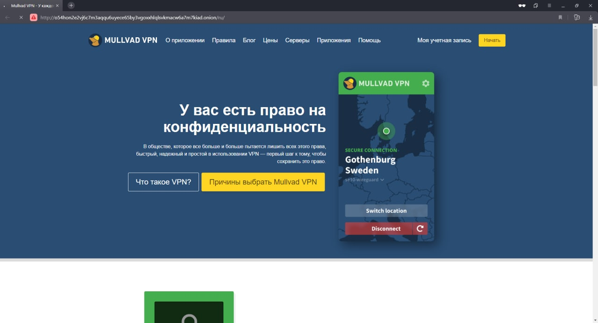

# OpenVPN over Tor
[**Скачать конфиг**](https://github.com/f5ociety/OpenVPN-over-Tor/releases/download/v2.0/tor.ovpn)

[**Настройка моста obfs4**](https://sigvids.gitlab.io/create-tor-private-obfs4-bridges.html) - вы сможете использовать мост лично, поставив его в настройках Tor браузера.

# Настройка сервера
Пускаем на VPN-сервере весь трафик клиентов через сеть Tor. Позволяет открывать ``.onion`` ресурсы в любом браузере. 

```bash 
# add user
adduser user
usermod -aG sudo
su user
cd ~

# install and settings openVPN
wget https://git.io/vpn -O openvpn-install.sh
sudo bash openvpn-install.sh

# install and settings tor
sudo apt install tor
sudo echo -e "VirtualAddrNetwork 10.192.0.0/10 \nAutomapHostsOnResolve 1 \nDNSPort 10.8.0.1:53530 \nTransPort 10.8.0.1:9040" >> /etc/tor/torrc
sudo systemctl restart tor

# settings iptables
sudo iptables -A INPUT -i tun0 -s 10.8.0.0/24 -m state --state NEW -j ACCEPT
sudo iptables -t nat -A PREROUTING -i tun0 -p udp --dport 53 -s 10.8.0.0/24 -j DNAT --to-destination 10.8.0.1:53530
sudo iptables -t nat -A PREROUTING -i tun0 -p tcp -s 10.8.0.0/24 -j DNAT --to-destination 10.8.0.1:9040
sudo iptables -t nat -A PREROUTING -i tun0 -p udp -s 10.8.0.0/24 -j DNAT --to-destination 10.8.0.1:9040
```

# Screenshots


Открытый ``.onion`` ресурс внутри _**Yandex браузера**_

**!Важно** - в браузере **``Firefox``** нужно поставить зайти в ``about:config`` и поставить у настройки ``network.dns.blockDotOnion`` значение ``false``.
